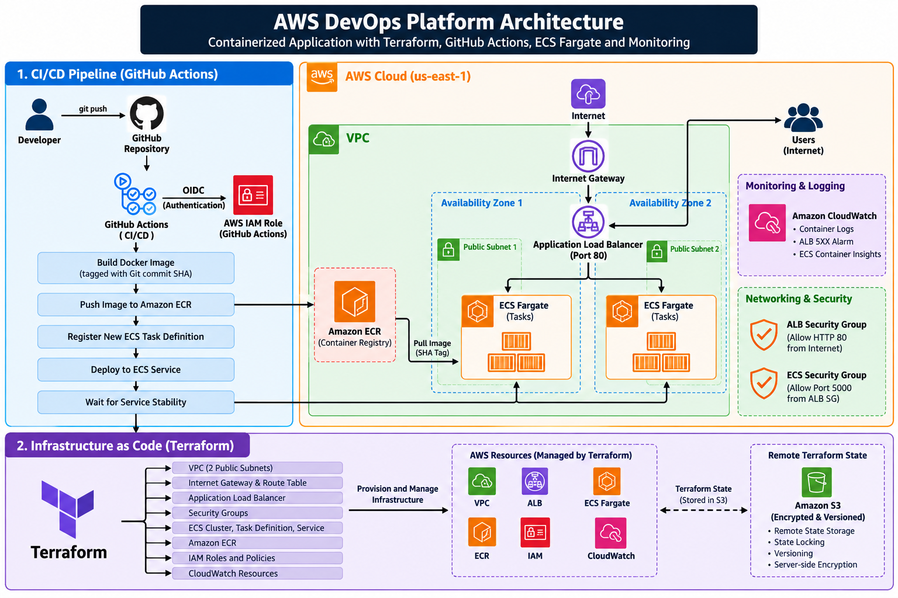

# AWS DevOps Platform

A production-style DevOps project that demonstrates how to containerize, provision, deploy, and monitor a web application on AWS using Docker, Terraform, GitHub Actions, Amazon ECR, Amazon ECS Fargate, Application Load Balancer, and CloudWatch.

The project implements Infrastructure as Code (IaC), container-based deployment, GitHub Actions CI/CD, AWS OIDC authentication, immutable image tagging, remote Terraform state, health checks, centralized logging, and monitoring.

---

## Architecture



```text
Developer
    |
    | git push
    v
GitHub Repository
    |
    v
GitHub Actions
    |
    | OIDC Authentication
    v
AWS IAM Role
    |
    +--------------------+
    |                    |
    v                    v
Docker Build        Amazon ECR
                         |
                         | SHA-tagged image
                         v
                  ECS Task Definition
                         |
                         v
                   ECS Fargate
                         |
                         v
              Application Load Balancer
                         |
                         v
                     Internet


Infrastructure Management
-------------------------

Terraform
    |
    +--> VPC
    +--> Public Subnets (2 AZs)
    +--> Internet Gateway
    +--> Route Table
    +--> Security Groups
    +--> Application Load Balancer
    +--> Target Group
    +--> Amazon ECR
    +--> Amazon ECS
    +--> IAM Roles
    +--> CloudWatch
    |
    v
Amazon S3
Remote Terraform State
+ Versioning
+ Encryption
+ State Locking
```

---

## Technologies Used

| Technology | Purpose |
|---|---|
| AWS | Cloud platform |
| Terraform | Infrastructure as Code |
| Docker | Application containerization |
| Amazon ECR | Container image registry |
| Amazon ECS | Container orchestration |
| AWS Fargate | Serverless container compute |
| Application Load Balancer | Application traffic distribution |
| Amazon VPC | Network isolation |
| AWS IAM | Access control |
| GitHub Actions | CI/CD automation |
| GitHub OIDC | Keyless CI/CD authentication |
| Amazon CloudWatch | Logging and monitoring |
| Amazon S3 | Remote Terraform state |
| Flask | Web application |
| Gunicorn | Production WSGI server |

---

## Infrastructure

The AWS infrastructure is provisioned using Terraform.

The environment contains:

- One custom VPC
- Two public subnets across two Availability Zones
- Internet Gateway
- Public route table
- Application Load Balancer
- ALB security group
- ECS security group
- ECS Fargate cluster
- ECS task definition
- ECS service
- Amazon ECR repository
- ECR lifecycle policy
- IAM task execution role
- GitHub Actions IAM role
- CloudWatch log group
- CloudWatch ALB 5XX alarm
- S3 Terraform remote backend

The ECS security group accepts application traffic only from the Application Load Balancer security group.

---

## Application

The sample application is built with Flask and runs inside a Docker container.

Gunicorn is used as the production WSGI server.

The application exposes a health endpoint:

```text
/health
```

Example response:

```json
{
  "service": "aws-devops-platform",
  "status": "healthy"
}
```

The Application Load Balancer uses this endpoint to determine whether ECS tasks are healthy.

---

## Docker

The application is packaged as a Docker image.

Example local build:

```bash
docker build -t aws-devops-platform ./app
```

The production container runs the Flask application through Gunicorn.

Container port:

```text
5000
```

---

## CI/CD Pipeline

Application deployments are automated using GitHub Actions.

A deployment is triggered when application code or the deployment workflow changes on the `main` branch.

The pipeline performs the following process:

```text
Git Push
   |
   v
GitHub Actions
   |
   v
Authenticate to AWS using OIDC
   |
   v
Build Docker Image
   |
   v
Tag Image with Git Commit SHA
   |
   v
Push Image to Amazon ECR
   |
   v
Read Current ECS Task Definition
   |
   v
Create New Task Definition Revision
   |
   v
Deploy Revision to ECS
   |
   v
Wait for ECS Service Stability
   |
   v
Verify Deployment
```

---

## Immutable Container Image Tags

Each CI/CD deployment uses the Git commit SHA as the Docker image tag.

Example:

```text
aws-devops-platform-dev:3325df0dcdbab60491b2a0bba102ade31415048d
```

This provides traceability between:

```text
Git Commit -> Docker Image -> ECS Deployment
```

It also avoids repeatedly overwriting a generic deployment tag.

---

## GitHub Actions Authentication

GitHub Actions authenticates with AWS using OpenID Connect (OIDC).

The workflow therefore does not require long-lived AWS access keys to be stored in GitHub.

Authentication flow:

```text
GitHub Actions
      |
      | OIDC token
      v
AWS IAM
      |
      | AssumeRoleWithWebIdentity
      v
GitHub Actions IAM Role
```

The deployment role is granted permissions required for:

- ECR authentication
- Pushing images to the project ECR repository
- Reading and registering ECS task definitions
- Updating the ECS service
- Passing the ECS task execution role

---

## Terraform

Terraform manages the AWS infrastructure.

Main Terraform files:

```text
terraform/
├── main.tf
├── providers.tf
├── variables.tf
├── outputs.tf
└── .terraform.lock.hcl
```

Initialize Terraform:

```bash
terraform init
```

Format:

```bash
terraform fmt
```

Validate:

```bash
terraform validate
```

Preview infrastructure changes:

```bash
terraform plan
```

Apply approved infrastructure changes:

```bash
terraform apply
```

---

## Terraform Remote State

Terraform state is stored remotely in Amazon S3 instead of relying only on a local state file.

Backend:

```text
S3 bucket
└── dev/
    └── terraform.tfstate
```

The backend uses:

- S3 versioning
- Server-side encryption
- Terraform state locking

This protects the state from accidental loss and helps prevent concurrent Terraform operations from modifying the state simultaneously.

Terraform state files are excluded from Git.

---

## Terraform and CI/CD Ownership

Terraform manages the ECS service infrastructure, while GitHub Actions manages application deployments.

GitHub Actions creates new ECS task definition revisions whenever a new application image is deployed.

Terraform therefore ignores CI/CD-driven changes to:

```text
task_definition
```

The project also allows the ECS service to be manually scaled down when the environment is not being used, so Terraform ignores changes to:

```text
desired_count
```

This prevents Terraform from unintentionally reverting application deployments or restarting intentionally stopped Fargate tasks.

---

## Networking

The application is deployed across two Availability Zones.

```text
Internet
   |
   v
Internet Gateway
   |
   v
Application Load Balancer
   |
   +-----------------------+
   |                       |
Public Subnet 1       Public Subnet 2
   |                       |
   +----------+------------+
              |
              v
         ECS Fargate
```

The Application Load Balancer accepts HTTP traffic on port `80`.

The ECS application listens on port `5000`.

The ECS security group permits port `5000` traffic from the ALB security group rather than directly from the internet.

---

## Health Checks

The Application Load Balancer checks:

```text
GET /health
```

Expected HTTP status:

```text
200
```

Only healthy ECS tasks receive application traffic.

---

## Logging

ECS container logs are sent to Amazon CloudWatch Logs.

Log group:

```text
/ecs/aws-devops-platform-dev
```

Log retention is configured for seven days.

This allows container output and application activity to be inspected centrally without connecting directly to the container.

---

## Monitoring

A CloudWatch alarm monitors Application Load Balancer target HTTP 5XX errors.

The alarm provides infrastructure-level visibility into server-side application failures.

ECS Container Insights is also enabled on the ECS cluster.

---

## ECR Lifecycle Management

The Amazon ECR repository has an automated lifecycle policy.

Only the ten most recent container images are retained.

Older images are automatically expired, preventing unlimited container image accumulation.

---

## Security

Security controls implemented in this project include:

- GitHub Actions OIDC authentication
- No long-lived AWS credentials stored in GitHub
- IAM role-based ECS execution
- Restricted GitHub Actions deployment permissions
- Security-group-to-security-group application access
- Public access blocking for the Terraform state bucket
- S3 server-side encryption for Terraform state
- S3 state versioning
- Terraform state excluded from Git
- Environment files excluded from Git
- ECR image scanning on push

For a production environment, HTTPS with ACM, private ECS subnets, VPC endpoints/NAT architecture where appropriate, and further IAM least-privilege hardening would be recommended.

---

## Repository Structure

```text
aws-devops-platform/
│
├── .github/
│   └── workflows/
│       └── deploy.yml
│
├── app/
│   ├── Dockerfile
│   ├── requirements.txt
│   └── ...
│
├── terraform/
│   ├── main.tf
│   ├── providers.tf
│   ├── variables.tf
│   ├── outputs.tf
│   └── .terraform.lock.hcl
│
├── .gitignore
└── README.md
```

---

## Deployment Verification

ECS service status can be checked with:

```bash
aws ecs describe-services \
  --cluster aws-devops-platform-dev-cluster \
  --services aws-devops-platform-dev-service \
  --region us-east-1
```

Application health can be tested through the load balancer:

```bash
curl http://<ALB-DNS-NAME>/health
```

Expected response:

```json
{
  "service": "aws-devops-platform",
  "status": "healthy"
}
```

---

## Cost Control

The development ECS service can be manually scaled to zero when the application is not required.

This stops Fargate task compute while allowing the infrastructure configuration to remain available for future deployment.

Other AWS resources such as the Application Load Balancer may continue to incur charges while provisioned.

---

## Skills Demonstrated

This project demonstrates practical experience with:

- AWS architecture
- Infrastructure as Code
- Terraform
- Docker
- Amazon ECS Fargate
- Amazon ECR
- Application Load Balancer
- Amazon VPC networking
- IAM
- GitHub Actions
- OIDC federation
- CI/CD pipelines
- Immutable deployments
- CloudWatch logging
- CloudWatch monitoring
- Terraform remote state
- Infrastructure lifecycle management
- AWS cost-aware development

---

## Future Improvements

Potential production improvements include:

- HTTPS using AWS Certificate Manager
- Route 53 custom domain
- ECS tasks in private subnets
- ECS Service Auto Scaling
- CloudWatch dashboards
- SNS alarm notifications
- AWS WAF
- Automated Terraform CI checks
- Separate development and production environments
- More restrictive IAM permissions for Terraform administration

---

## Author

**Yabesh J**

Cloud & DevOps Project